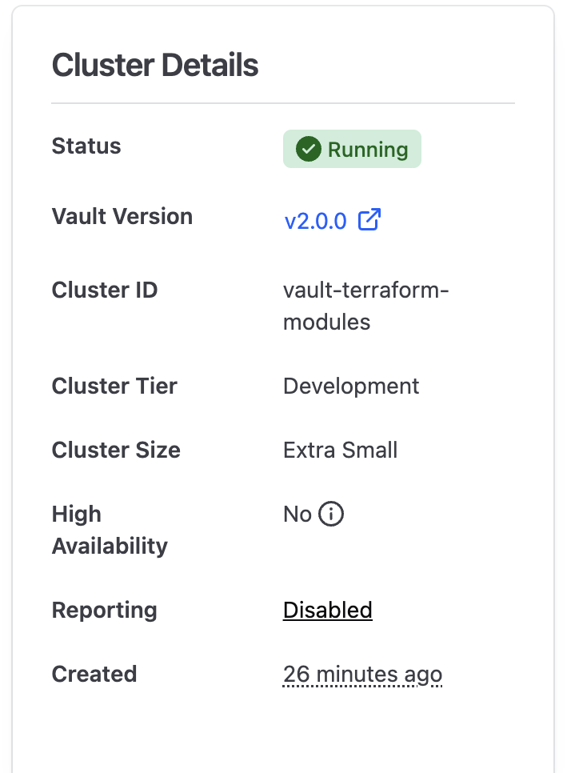
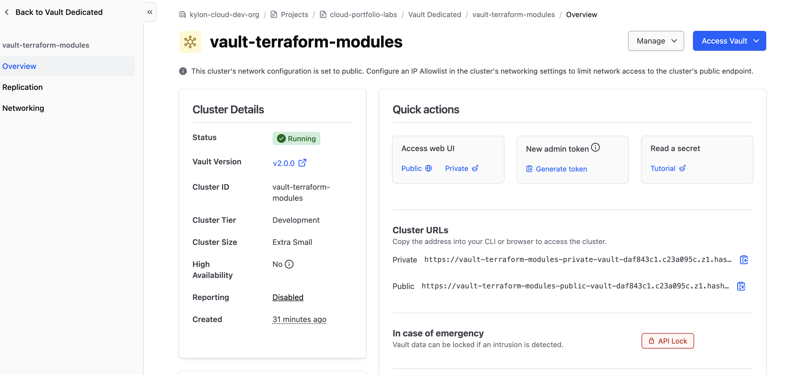
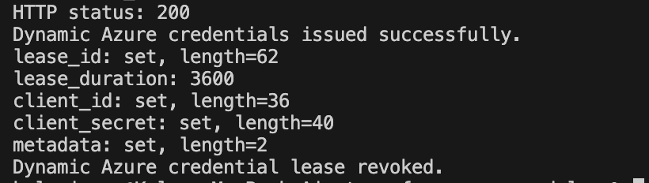
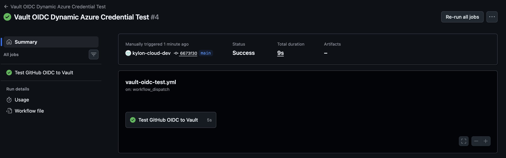
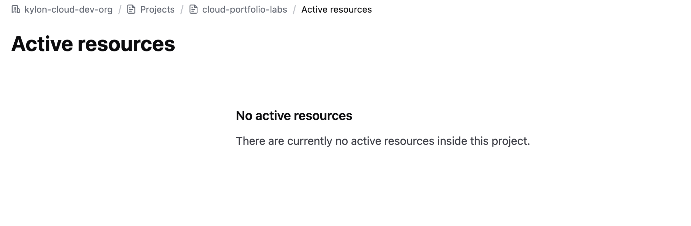

# Terraform Azure Module Library with HCP Terraform and Vault OIDC

## Project Overview

This project demonstrates a reusable Terraform module library for Azure infrastructure.

It includes versioned Terraform modules for Azure Virtual Network, Azure Container Registry, and Azure Kubernetes Service. The modules were validated with GitHub Actions and published to the HCP Terraform private registry.

The project also demonstrates a secure DevSecOps credential pattern using HashiCorp Vault, GitHub Actions OIDC, and Azure dynamic credentials. Instead of storing long-lived Azure credentials directly in GitHub repository secrets, GitHub Actions authenticates to Vault using OIDC and Vault issues short-lived Azure credentials at runtime.

This project was designed to show practical experience with Terraform module design, HCP Terraform, GitHub Actions, HashiCorp Vault, Azure identity, dynamic credentials, and cloud security troubleshooting.

---

## Business Problem

Cloud teams often repeat the same Terraform patterns across multiple projects. Without reusable modules, each team may configure networking, container registries, and Kubernetes clusters differently.

This can lead to:

* Inconsistent infrastructure standards
* Duplicated Terraform code
* Harder security reviews
* Manual module publishing
* Long-lived credentials stored in CI/CD systems

This project solves that problem by creating reusable Azure modules, validating them through CI, publishing them to a private Terraform registry, and demonstrating secure credential retrieval through Vault.

---

## Tools and Technologies

| Category | Tools |
| --- | --- |
| Cloud Provider | Microsoft Azure |
| Infrastructure as Code | Terraform |
| Module Registry | HCP Terraform Private Registry |
| Secrets Management | HashiCorp Vault Dedicated |
| CI/CD | GitHub Actions |
| Identity and Access | GitHub Actions OIDC, Microsoft Entra ID, Azure RBAC |
| Azure Services | Virtual Network, Azure Container Registry, Azure Kubernetes Service |
| CLI Tools | Azure CLI, Terraform CLI, curl, jq |

---

## Architecture

    Developer Push to GitHub
            |
            v
    GitHub Repository
            |
            v
    GitHub Actions Validation
            |
            v
    Terraform Module Library
            |
            +--> VNet Module
            +--> ACR Module
            +--> AKS Module
            |
            v
    HCP Terraform Private Registry

Vault and GitHub Actions OIDC flow:

    GitHub Actions Workflow
            |
            v
    GitHub OIDC Token
            |
            v
    Vault JWT Auth Method
            |
            v
    Vault Policy
            |
            v
    Vault Azure Secrets Engine
            |
            v
    Short-Lived Azure Credentials

---

## Repository Structure

    terraform-azure-modules/
    ├── .github/
    │   └── workflows/
    │       ├── validate.yml
    │       ├── publish.yml
    │       └── vault-oidc-test.yml
    ├── examples/
    │   └── complete/
    ├── modules/
    │   ├── vnet/
    │   ├── acr/
    │   └── aks/
    ├── screenshots/
    ├── vault-infra/
    ├── .gitignore
    ├── README.md
    └── troubleshooting.md

---

## Terraform Modules

### 1. VNet Module

The VNet module creates an Azure Virtual Network and one or more subnets.

Source directory:

    modules/vnet

Resources created:

* Azure Virtual Network
* Azure subnets
* Optional resource tags

---

### 2. ACR Module

The ACR module creates an Azure Container Registry with configurable SKU, admin access settings, and optional tags.

Source directory:

    modules/acr

Resources created:

* Azure Container Registry
* Configurable SKU
* Optional admin access setting
* Optional resource tags

---

### 3. AKS Module

The AKS module creates an Azure Kubernetes Service cluster baseline with managed identity, Azure networking, and optional ACR pull access.

Source directory:

    modules/aks

Resources created:

* Azure Kubernetes Service cluster
* System-assigned managed identity
* Azure CNI networking
* Azure network policy
* Optional AcrPull role assignment for Azure Container Registry

---

## Complete Example

The examples/complete configuration demonstrates how the modules can be used together.

    Resource Group
            |
            +--> Virtual Network
            |       |
            |       +--> AKS Subnet
            |
            +--> Azure Container Registry
            |
            +--> Azure Kubernetes Service
                    |
                    +--> AcrPull access to ACR

---

## HCP Terraform Private Registry

The modules were published to the HCP Terraform private registry using tag-based module publishing.

| Module | Provider | Version | Source Directory | Git Tag |
| --- | --- | --- | --- | --- |
| vnet | azurerm | 1.0.0 | modules/vnet | vnet-v1.0.0 |
| acr | azurerm | 1.0.0 | modules/acr | acr-v1.0.0 |
| aks | azurerm | 1.0.0 | modules/aks | aks-v1.0.0 |

---

## GitHub Actions Workflows

| Workflow | Purpose |
| --- | --- |
| validate.yml | Validates Terraform formatting and module syntax. |
| publish.yml | Manual publishing workflow placeholder for future automation. |
| vault-oidc-test.yml | Tests GitHub Actions OIDC authentication to Vault and dynamic credential issuance. |

---

## Security Controls Implemented

| Security Control | Purpose |
| --- | --- |
| Reusable Terraform modules | Standardizes infrastructure patterns across projects. |
| GitHub Actions validation | Confirms module formatting and syntax before changes are accepted. |
| HCP Terraform private registry | Publishes reusable modules from a controlled registry. |
| GitHub Actions OIDC | Avoids storing long-lived cloud credentials directly in GitHub secrets. |
| Vault JWT authentication | Allows GitHub Actions to authenticate to Vault using short-lived OIDC tokens. |
| Vault policies | Limits GitHub Actions access to the required credential path. |
| Vault Azure secrets engine | Issues short-lived Azure credentials at runtime. |
| Cleanup process | Removes lab resources and sensitive local files after testing. |

---

## Screenshots and Verification

### GitHub Actions Validation Success

The Terraform validation workflow completed successfully.

---

### HCP Terraform VNet Module Published

---

### HCP Terraform ACR Module Published

---

### HCP Terraform AKS Module Published

---

### HCP Vault Cluster Running

An HCP Vault Dedicated development cluster was created for testing Vault authentication and Azure dynamic credentials.

---

### HCP Vault Cluster Overview

---

### Vault Dynamic Azure Credentials Issued Locally

Vault successfully issued short-lived Azure credentials locally and the credential lease was revoked after testing.

---

### GitHub Actions OIDC to Vault Success

GitHub Actions successfully authenticated to Vault using OIDC and completed the Vault credential workflow.

---

### HCP Cleanup Verification

HCP resources were deleted after the lab to avoid unnecessary charges.

---

## Verification Results

The project successfully demonstrated:

    Terraform module validation: Passed
    HCP Terraform module publishing: Completed
    VNet module version: 1.0.0
    ACR module version: 1.0.0
    AKS module version: 1.0.0
    Vault local dynamic credential test: Passed
    GitHub Actions OIDC to Vault test: Passed
    HCP and Azure cleanup: Completed

---

## Troubleshooting Performed

During the project, I resolved several real-world Terraform, HCP Terraform, Vault, and Azure identity issues.

| Issue | Resolution |
| --- | --- |
| Shell entered heredoc mode | Closed the heredoc properly and avoided pasting incomplete shell blocks. |
| HCP Terraform module setup failed because tags were missing | Created module-specific version tags such as vnet-v1.0.0, acr-v1.0.0, and aks-v1.0.0. |
| AKS module showed AzureRM provider deprecation warning | Documented the provider warning and kept the module compatible with the AzureRM configuration used in the project. |
| Vault Azure secrets engine returned insufficient privilege errors | Added required Microsoft Graph permissions and Azure role assignment permissions. |
| Azure/Entra propagation delayed dynamic credential creation | Retried after propagation and adjusted the CI proof to use an existing low-privilege app registration. |
| Sensitive service principal secret appeared in terminal output | Treated the credential as exposed, deleted/rotated the identity, and recreated credentials safely. |
| HCP resources remained active after Vault testing | Deleted the Vault cluster and HashiCorp Virtual Networks after validation. |

---

## What I Learned

This project strengthened my understanding of:

* Designing reusable Terraform modules
* Structuring a multi-module Terraform repository
* Validating Terraform modules with GitHub Actions
* Publishing modules to the HCP Terraform private registry
* Configuring Vault JWT authentication for GitHub Actions OIDC
* Using Vault to issue short-lived Azure credentials
* Troubleshooting Azure/Entra ID permissions and propagation delays
* Cleaning up HCP, Azure, Terraform state, and local secret files after testing

---

## How to Recreate This Project

### 1. Clone the Repository

    git clone https://github.com/kylon-cloud-dev/terraform-azure-modules.git
    cd terraform-azure-modules

### 2. Validate the Modules Locally

    terraform fmt -recursive modules examples

    cd modules/vnet
    terraform init -backend=false
    terraform validate
    cd ../..

    cd modules/acr
    terraform init -backend=false
    terraform validate
    cd ../..

    cd modules/aks
    terraform init -backend=false
    terraform validate
    cd ../..

    cd examples/complete
    terraform init -backend=false
    terraform validate
    cd ../..

### 3. Publish Modules to HCP Terraform

Create module-specific tags:

    git tag vnet-v1.0.0
    git tag acr-v1.0.0
    git tag aks-v1.0.0
    git push origin vnet-v1.0.0 acr-v1.0.0 aks-v1.0.0

Publish each module in HCP Terraform using:

    vnet -> modules/vnet -> tag prefix vnet-
    acr  -> modules/acr  -> tag prefix acr-
    aks  -> modules/aks  -> tag prefix aks-

### 4. Configure Vault

Create an HCP Vault Dedicated development cluster, generate an admin token, and create a local terraform.tfvars file from:

    vault-infra/terraform.tfvars.example

Then apply the Vault configuration:

    cd vault-infra
    terraform init
    terraform plan
    terraform apply
    cd ..

### 5. Run the GitHub Actions OIDC Test

Add the following GitHub Actions secrets:

    VAULT_ADDR
    VAULT_NAMESPACE

Then run the workflow manually:

    Actions -> Vault OIDC Dynamic Azure Credential Test -> Run workflow

---

## Cleanup

To avoid unnecessary charges and reduce security risk, remove lab resources after testing.

Cleanup completed in this project:

* Deleted the HCP Vault Dedicated cluster
* Deleted HashiCorp Virtual Networks
* Removed Azure lab app registrations and service principals
* Removed local Terraform variable and state files
* Unset local Vault and Azure credential environment variables
* Confirmed Git working tree was clean

Example local cleanup:

    rm -f vault-infra/terraform.tfvars
    rm -f vault-infra/terraform.tfstate
    rm -f vault-infra/terraform.tfstate.backup

    unset VAULT_TOKEN
    unset VAULT_ADDR
    unset VAULT_NAMESPACE
    unset VAULT_SP_CLIENT_SECRET
    unset SP_JSON

---

## Interview Talking Point

I built a reusable Terraform module library for Azure infrastructure and published the modules to the HCP Terraform private registry. I also configured HashiCorp Vault with GitHub Actions OIDC so a workflow could authenticate to Vault without storing Azure credentials directly in GitHub secrets. Vault issued short-lived Azure credentials at runtime, and I documented the troubleshooting, validation, and cleanup process end to end.
