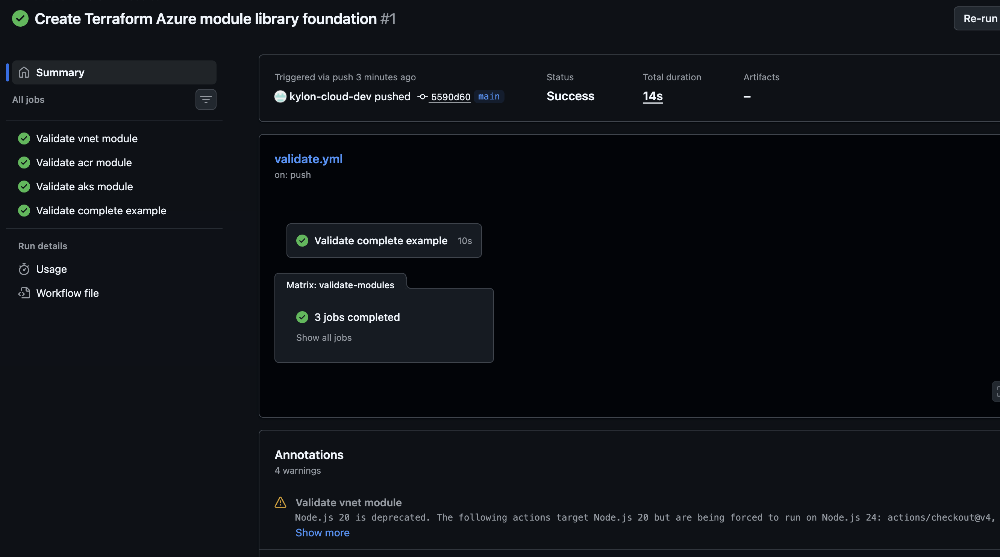
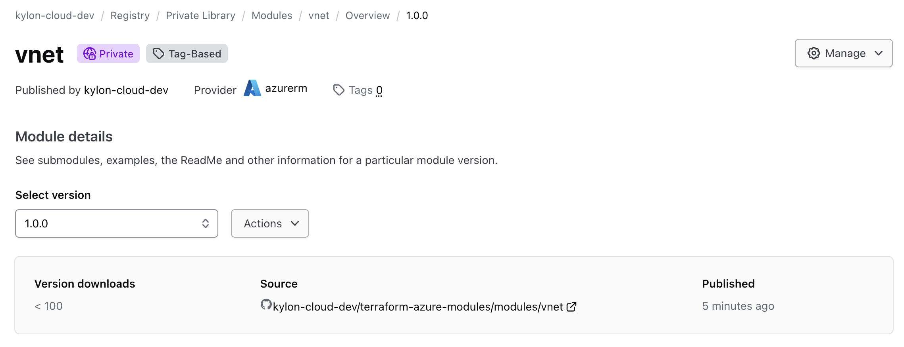
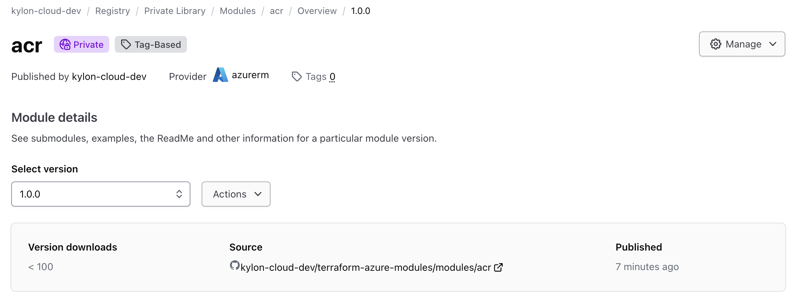
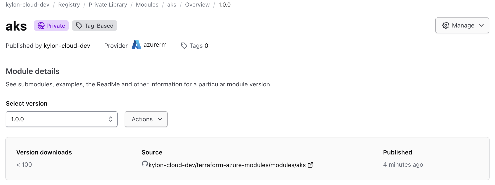

# Terraform Azure Module Library

This project is a reusable Terraform module library for Azure infrastructure. It demonstrates how platform and cloud engineering teams can standardize common infrastructure patterns using versioned Terraform modules, CI validation, and secure runtime credential handling.

## Project Goals

- Build reusable AzureRM Terraform modules
- Validate modules with GitHub Actions
- Demonstrate a complete example using multiple modules together
- Prepare modules for publishing to a private Terraform Cloud registry
- Integrate HashiCorp Vault with GitHub Actions OIDC for dynamic Azure credentials

## Business Problem

When every team writes Terraform from scratch, infrastructure becomes inconsistent. Network address spaces, container registry settings, Kubernetes cluster defaults, and security controls can drift across teams.

A Terraform module library solves this by giving teams approved building blocks. Instead of copying and modifying Terraform code, teams consume tested modules with clear inputs, outputs, and versioning.

## Repository Structure

```text
terraform-azure-modules/
├── modules/
│   ├── vnet/
│   ├── acr/
│   └── aks/
├── examples/
│   └── complete/
├── .github/
│   └── workflows/
│       ├── validate.yml
│       └── publish.yml
├── README.md
└── troubleshooting.md


## HCP Terraform Private Registry

The VNet, ACR, and AKS modules were published to the HCP Terraform private registry using tag-based publishing.

| Module | Provider | Version | Source Directory |
|---|---|---|---|
| vnet | azurerm | 1.0.0 | modules/vnet |
| acr | azurerm | 1.0.0 | modules/acr |
| aks | azurerm | 1.0.0 | modules/aks |

### Registry Screenshots

#### GitHub Actions Validation



#### VNet Module Published



#### ACR Module Published



#### AKS Module Published



---

## HCP Terraform + Vault OIDC Integration

This project also demonstrates a secure cloud automation workflow using **HCP Terraform**, **HashiCorp Vault**, **GitHub Actions OIDC**, and **Azure dynamic credentials**.

### What was implemented

- Published reusable Terraform modules to the HCP Terraform private registry:
  - `vnet`
  - `acr`
  - `aks`
- Configured GitHub Actions validation for all Terraform modules.
- Deployed an HCP Vault Dedicated development cluster for testing.
- Configured Vault with:
  - JWT/OIDC authentication for GitHub Actions
  - A GitHub Actions Vault policy
  - Azure secrets engine
  - Dynamic Azure credential role
- Tested short-lived Azure credential generation locally.
- Tested GitHub Actions authentication to Vault using OIDC.
- Removed local sensitive files and destroyed HCP/Azure lab resources after validation.

### Security outcome

Instead of storing long-lived Azure credentials in GitHub repository secrets, this workflow uses GitHub Actions OIDC to authenticate to Vault. Vault then issues short-lived Azure credentials at runtime. This reduces credential exposure and supports a stronger cloud security model.

### Validation screenshots

| Evidence | Screenshot |
|---|---|
| GitHub Actions Terraform validation passed | `screenshots/github-actions-validation-success.png` |
| HCP Terraform VNet module published | `screenshots/hcp-terraform-vnet-module-published.png` |
| HCP Terraform ACR module published | `screenshots/hcp-terraform-acr-module-published.png` |
| HCP Terraform AKS module published | `screenshots/hcp-terraform-aks-module-published.png` |
| HCP Vault cluster running | `screenshots/hcp-vault-cluster-running.png` |
| HCP Vault cluster overview | `screenshots/hcp-vault-cluster-overview.png` |
| Vault issued dynamic Azure credentials locally | `screenshots/vault-dynamic-credentials-success.png` |
| GitHub Actions OIDC to Vault workflow succeeded | `screenshots/github-actions-vault-oidc-success.png` |
| HCP resources cleaned up | `screenshots/hcp-no-active-resources.png` |

### Troubleshooting notes

During testing, Azure/Entra permissions required additional Microsoft Graph application permissions before Vault could issue Azure credentials successfully. The final working setup required validating app registration permissions, role assignment behavior, and Azure propagation timing.

This was handled by:
- Confirming the Vault service principal could request Microsoft Graph tokens.
- Testing Microsoft Graph app registration creation.
- Adding required Microsoft Graph permissions.
- Verifying local dynamic credential issuance before CI validation.
- Using an existing low-privilege app registration for the GitHub Actions CI proof to avoid Azure service principal propagation delays during workflow execution.

### Cleanup performed

After testing, the following cleanup was completed:

- Deleted the HCP Vault Dedicated cluster.
- Deleted HashiCorp Virtual Networks created for the lab.
- Removed Azure lab app registrations/service principals.
- Removed local Terraform variable and state files containing sensitive values.
- Unset local Vault and Azure credential environment variables.
- Confirmed Git working tree was clean.

